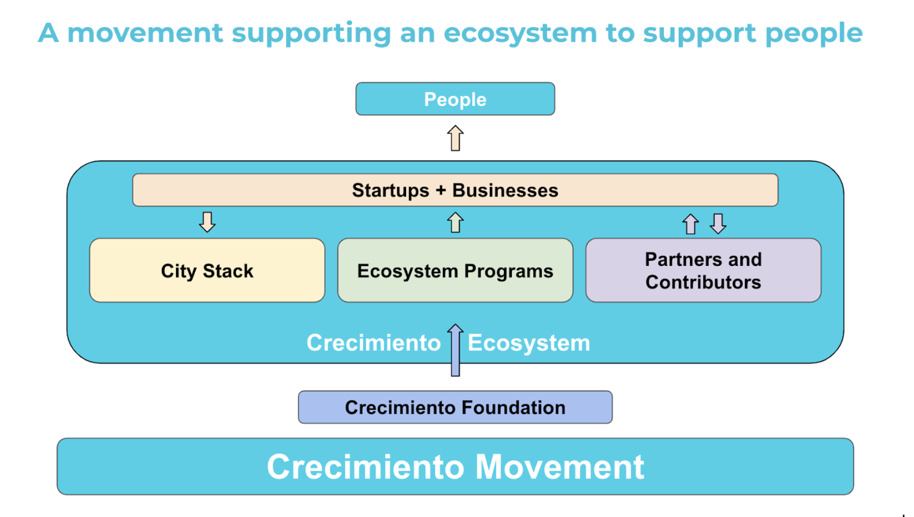

# Ecosystem Programs: what people are building

Ecosystem Programs are self-driven initiatives designed to advance Crecimiento’s vision by supporting the crypto ecosystem’s growth in Argentina. These programs, launched by contributors, partners, and companies, work within the Crecimiento Foundation to drive innovation, empower builders and grow crypto adoption. They are a fundamental piece of making Crecimiento a strong and resilient movement, capable of achieving amazing things in very short time.

Anyone within the ecosystem—contributors, startups, institutions, or companies—can propose an Ecosystem Program. While these programs operate independently, they are supported by the Foundation with resources recognition, mentorship, and access to a network of collaborators. This ensures alignment with Crecimiento’s mission while giving program creators the freedom to innovate and lead their initiatives.

## Roadmap for next months

<figure><figcaption></figcaption></figure>

Check out all the amazing programs people are building!
